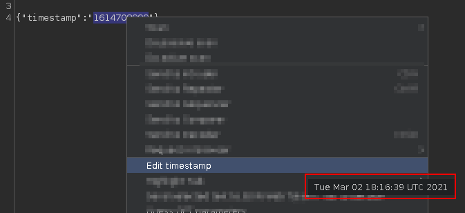
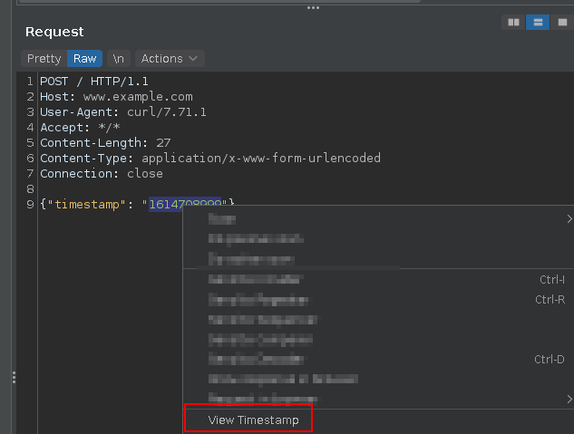
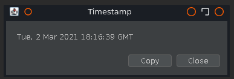

Provides a GUI to view and edit Unix timestamps in Burp message editors.

Select the timestamp, then right-click and choose "Edit Timestamp" or "View Timestamp". It can handle timestamps in 
seconds, milliseconds, and microseconds (although the UI reverts this to 0 milli/microseconds).

The "Edit Timestamp" menu is only available on editable objects, and is disabled if the selected value cannot be parsed 
as a timestamp. If it can be parsed, there is also a tooltip on the menu item showing the date, for a quick conversion.

The "View Timestamp" menu is available on other objects (e.g. Proxy History), _if_ the selected value can be parsed
as a timestamp. Again, if it can be parsed, there is a tooltip.

#### Context menu

#### Date picker

#### Tooltip

#### Viewer

_This extension uses the [LGoodDatePicker](https://github.com/LGoodDatePicker/LGoodDatePicker) library._