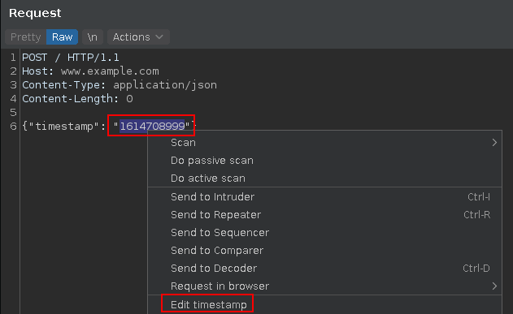
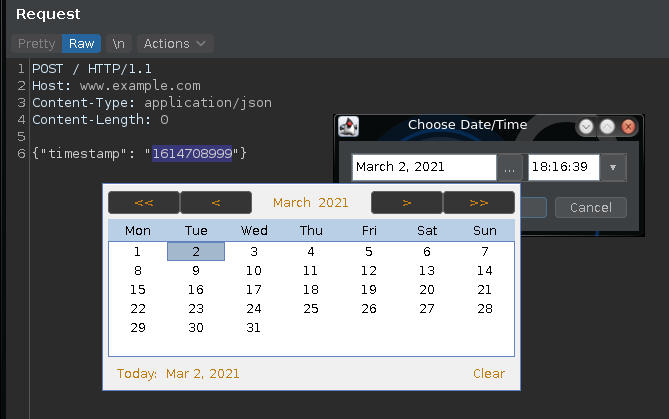

Provides a GUI to edit Unix timestamps in Burp message editors.

Select the timestamp, then right-click and choose "Edit Timestamp". 
It can handle timestamps in seconds, milliseconds, and microseconds 
(although the UI reverts this to 0 milli/microseconds).

The menu item will be disabled if the selected value cannot be parsed 
as a timestamp.

